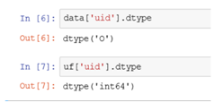
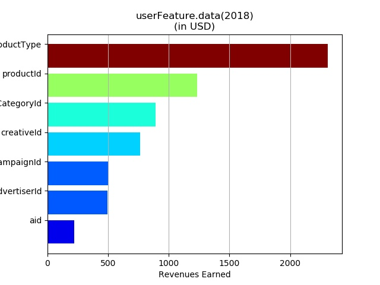

# 项目进展报告

##数据获取及预处理

###数据来源

本次实验数据来自2018年腾讯广告算法大赛-相似人群拓展任务官方提供的数据。数据提供了几百个种子人群、海量候选人群对应的用户特征，以及种子人群对应的广告特征。

###数据说明

比赛数据抽取的时间范围是某连续 30 天的数据。总体而言，数据分为：训练集数据文件、测试集数据文件、用户特征文件以及种子包对应的广告特征文件四部分。
**训练集数据文件 train.csv** 每行代表一个训练样本，各字段之间由逗号分隔，格式为：“aid,uid,label”。其中，aid 唯一标识一个广告，uid 唯一标识一个用户。 样本 label 的取值为 +1 或 -1，其中 +1 表示种子用户，-1 表示非种子用户。为简 化问题，一个种子包仅对应一个广告 aid，两者为一一对应的关系。
**测试集数据文件 test.csv**每行代表一个训练样本，各字段之间由逗号分隔，格式为：“aid,uid”。字段含义同训练集。
**用户特征文件 userFeature.data** 每 行 代 表 一 个 用 户 的 特 征 数 据， 格 式 为：
“uid|features”，uid 和 features 用竖线“|”分隔。其中 feature 采用 vowpal
wabbit（https://github.com/JohnLangford/vowpal_wabbit）格式：“feature_group1|feature_group2|feature_group3|...”。 每 个 feature_group
代表一个特征组，多个特征组之间也以竖线“|”分隔。一个特征组若包括多个值
则以空格分隔，格式为：“feature_group_name fea_name1 fea_name2 …”，
其中 fea_name 采用数据编号的格式。
**广告特征文件 adFeature.csv** 格式为：“aid,advertiserId,campaignId,creativeI
d,creativeSize,adCategoryId,productId,productType”。其中，aid 唯一标识一
个广告，其余字段为广告特征，各字段之间由逗号分隔。

####
**用户特征说明**

**用户特征**包含以下特征组（feature_group_name），如果具体特征取值未知，均
以 0 表示：
| 数据类型   |    说明   |包含字段|
| :-: | :-:| :-: |
| 年龄（age）| 分段表示，每个序号表示一个年龄分段 |     |
| 性别（gender）|   |男 / 女 |
| 婚姻状况（marriageStatus） |    | 单身 / 已婚等状态（多个状态可共存）|
|	学历（education）| |博士 / 硕士 / 本科 / 高中 / 初中 / 小学
|消费能力（consumptionAbility）|  |高 / 低|
|地理位置（LBS）| 每个序号代表一个地理位置|
|兴 趣 类 目（interest）| 由 不 同 数 据 源 挖 掘 得 到 的 5 个 特 征 组,每个兴趣特征组包含若干个兴趣 ID | interest1, interest2, interest3, interest4, interest5 表示|
|关键词（keyword）|较兴趣类目更细粒度地表示用户喜好，由不同数据源挖掘得到的 3 个特征组，每个关键词特征组包含若干用户感兴趣的关键词|kw1, kw2, kw3|
|主题（topic）| 使用 LDA 挖掘的用户喜好主题，由不同数据源挖掘得到的 3个特征组 | topic1, topic2, topic3|
|APP 近期安装行为（appIdInstall）| 63 天内安装的 APP | 每个 APP 表示为一个唯一的 ID|
|APP 活跃（appIdAction）| 用户使用的活跃 APP| |
|上网连接类型（ct）|  | WIFI/2G/3G/4G|
|操作系统（os）| | Android/IOS，不区分版本号|
|移动运营商（carrier）| 移动运营商 | 移动 / 联通 / 电信 / 其他|
| 有房（house） | 是否有房|

####
**广告特征说明**

| 数据类型   |    说明   |
| :-: | :-:|
|广告 ID（aid）| 广告是指广告主创建的广告创意（或称广告素材）及广告展示相关设置，包含广告的基本信息（广告名称、投放时间等）、广告的推广目标、投放平台、投放的广告规格、所投放的广告创意、广告的受众（即广告的定向设置）以及广告出价等信息|
|广告主 ID（advertiserId）|账户结构分为四级：账户——推广计划——广告——素材，账户和广告主是一一对应关系|
|推广计划 ID（campaignId）| 推广计划是广告的集合（类似电脑文件夹功能），广告主可以将推广平台、预算限额、是否匀速投放等条件相同的广告放在同一个推广计划中，方便管理|
| 素材 ID（creativeId）| 展示给用户直接看到的广告内容，一条广告下可以有多组素材|
| 素材大小（creativeSize）| 素材大小 ID，标识广告素材不同大小|
| 广告类目（adCategoryId）| 广告分类 ID，使用广告分类体系|
| 商品 ID（productId）| 推广的商品 ID，系统中用 product id 来标识|
| 商品类型（productType）| 广告投放目标对应的商品类型（如京东 -- 商品、app-- 下载）|

###数据预处理

这次比赛的任务是寻找相似人群，其实就可以看成是CTR问题。这种类型的竞赛，应该充分了解你的数据。
####长尾数据

对于ctr的数据，都有一个特点就是长尾数据。对于这种类型的数据，进行的操作是对尾部的数据数据设置成一个新的类别，至于尾部数据的阈值，使用plot之后调整。通过这种方式我们组造了一个强特征，有一个appInstall字段，这个字段代表的是60几天的安装的app，我们对这个字段进行了统计，统计了每个用户在这几天里app安装的数量，然后发现这是长尾数据，也就是大多数是这几天里没有安装app的，部分是安装了特别多app的，这部分结合实际的话，其实是安装app来刷单赚钱的人，对这部分人进行单独的分类处理效果不错，在初赛这个特征提升了2个千分点。
####正负样本比例

还有就是正负样本的比例问题，对于此类问题，因模型而异，对于lgb模型的话，如果正负样本差的很多的话，可以采取少采一些样本的方式比较多的类型的样本，比如ctr中正样本极少，所以我们就抽了90%的负样本和全量的正样本训练，训练我们的lgb模型，效果也是在初赛提升了2个千分点。但是对于FFM这样的流式训练的模型的话，不建议这么做，这样做会降低模型的效果。
####特征处理

在广告点击率和转化率的特征中，特征可以分为三类：数值特征（numberical feature），有序特征 （ordinal feature），无序特征（categorical feature）
对于特征的处理： 1.使用统计频率、转化次数特征、转化率特征代替onehot，由于数据量极大，one-hot编码会出现一个很大维数的稀疏矩阵，有一定可能运行好长时间不出结果。2.对训练集和测试集中的重复样本构造是否第一次点击，是否中间点击，是否最后点击，第一次和最后一次间隔特征。3.大量使用组合特征，主要是用户特征和广告上下文特征。成绩在baseline附近的新手基本上没有考虑组合特征以及特征之间的相关性直接使用单特征one-hot编码。
####其他技巧

**数据太大：**处理4个G的用户特征，而且不是能直接pandas读取的格式，所以需要做格式转换，用dict的方式来初始化DataFrame
**拼接用户特征，广告特征：**训练数据中负样本的标签给的是-1，需要先转成0，预测数据的标签置为-1，方便合并后区分数据集。将缺失值填充为 '-1' ，因为在LabelEncoder的时候需要对数据排序，同时存在string和int类型是无法比较的。所以需要填充为string类型的 ‘-1’而不是数值型的。
**单取值和多取值的离散特征的处理：**将单取值的离散特征使用稀疏方式one-hot，将多取值的离散特征使用稀疏方式向量化。

##数据分析与可视化

###数据分析

1. CountVectorizer()的用法：from sklearn.feature_extraction.text import CountVectorizer结果它默认将长度小于等于1的字符当停止词去掉了，因为我需要分析的特征vectorizer = CountVectorizer(min_df=0,token_pattern='\w+')。效果如图：

2. 使用pandas merge数据，出现不应该出现的NaN。查阅资料发现原因：待merge的两个表中的uid，dtype类型不同，造成python以为两个表没有共同键值，于是产生大量NaN。事实确实如此：

解决方案：直接更改uf['uid'].dtype会报错，应该使用pandas.DataFrame.astype()方法

3. pandas拆分数据

###数据可视化

处理数据：训练数据中负样本的标签给的是-1，需要先转成0，预测数据的标签置为-1，方便合并后区分数据集。 拼接用户特征，广告特征、最终的图用户对应的广告特征的个数

##模型选取

###GBDT

GBDT(梯度提升树)，是一个以回归树为基学习器，以boost为框架的加法模型的集成学习。GBDT基于GB算法。GB算法的主要思想是，每次建立模型是在之前建立模型损失函数的梯度下降方向。损失函数是评价模型性能(一般为拟合程度+正则项)，认为损失函数越小，性能越好。而让损失函数持续下降，就能使得模型不断调整提升性能，其最好的方法就是使损失函数沿着梯度方向下降。GBDT再此基础上，基于负梯度(当损失函数为均方误差的时候，可以看作是残差)做学习。

###LightGBM

LightGBM（Light Gradient Boosting Machine）是一个实现 GBDT 算法的框架，支持高效率的并行训练，并且具有以下优点：
- 更快的训练速度
- 更低的内存消耗
- 更好的准确率
- 分布式支持，可以快速处理海量数据

###FFM集成

本题目属于商用推荐场景中的CTR预估类型问题，此类问题容易面临大规模稀疏数据的挑战。因此引入因子分解机（ Factorization Machine, 简称FM ）及FFM（Field-aware Factorization Machine，场感知因子分解机）模型，通过对参数矩阵的低秩分解，来解决高维训练的低效问题。

##挖掘实验的结果

目前，我们进行了数据预处理工作，之后将继续有关数据挖掘的相关任务。

##目前遇到的问题

###内存的占用

使用lightGBM模型将比使用XGBoost模型少占用十多个G，同时在速度方面，lgb的训练速度为xgd的十倍左右。

###超大数据量的处理

在这种数据量超大的情况下，在编写神经网络的时候，一定要弄一个小的线下训练集，这样方便调试bug，开发速度也快。

##下一步工作

对于不同模型进行模型融合，通过加权平均两种方式融合。一般来说，融合的模型在原理上的差距越远，融合的效果越好（过拟合的部位不一样，融合后就可以减缓了过拟合的状况）。
